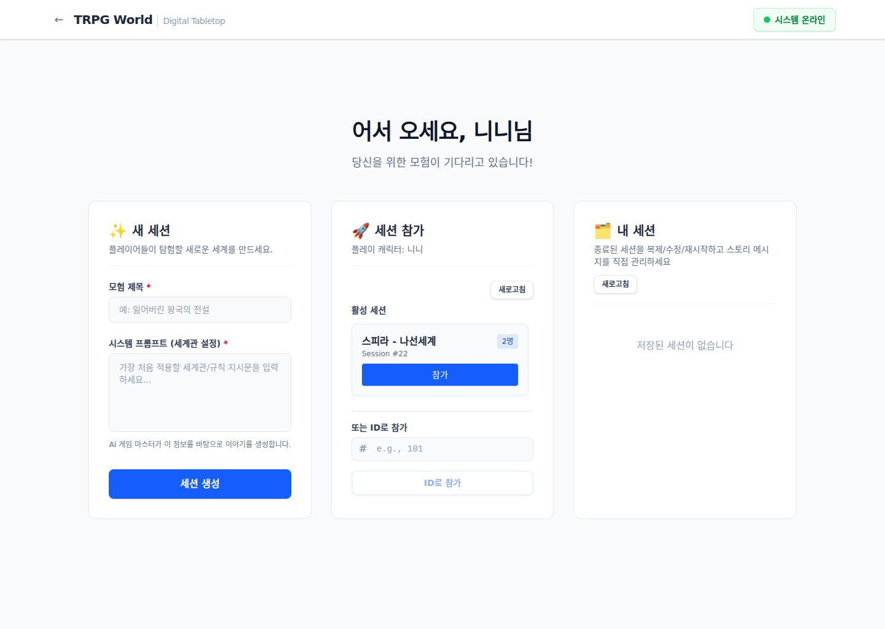
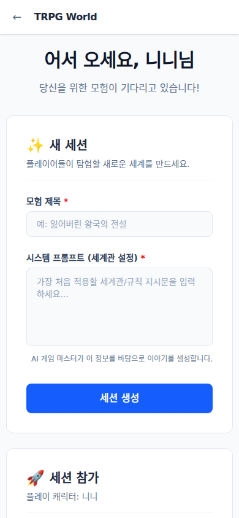
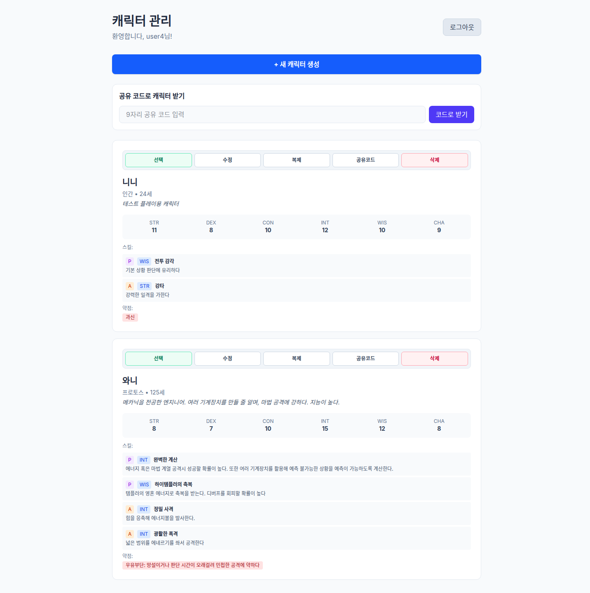
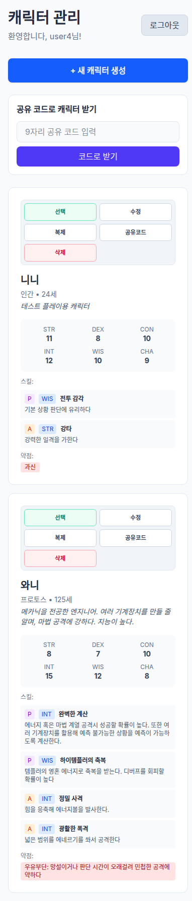
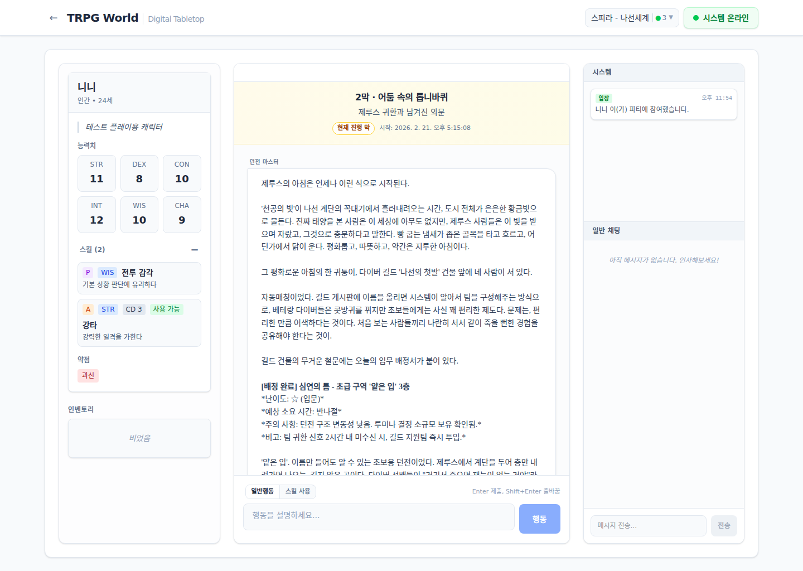
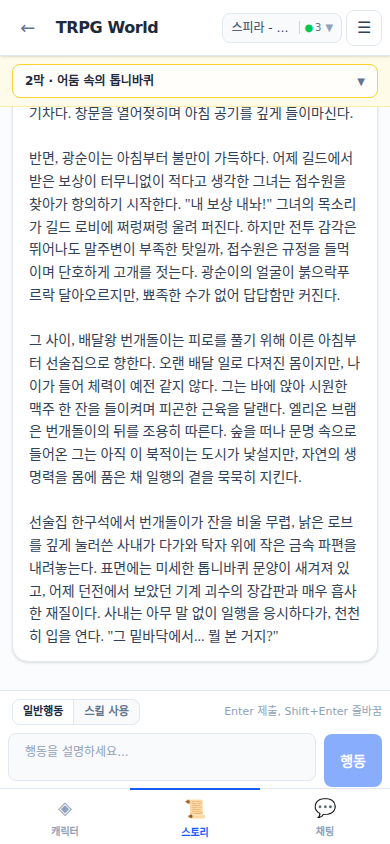

<p align="center">
  
</p>

<h1 align="center">TRPG World 🎲</h1>
<p align="center"><b>Real-time AI Game Master platform for multiplayer text TRPG sessions</b></p>

<p align="center">
  
  
  
  
  
</p>

---

## Why TRPG World?

Most TRPG tools are chat-first and slow to moderate in live sessions.
**TRPG World** is built for live host-led play:
- players submit actions in parallel,
- host curates and commits the scene,
- AI GM streams narrative in real time,
- and the story log is saved persistently.

It is designed to feel like a real session table, not a static chatbot.

---

## Core Features

- **Host-centered action queue moderation**
  - Players submit actions simultaneously
  - Host reorders/edits and commits one coherent turn

- **3-phase AI GM pipeline**
  - **Judgment**: Difficulty + modifier reasoning
  - **Dice**: d20-based resolution flow
  - **Narrative**: Outcome-based storytelling

- **Real-time multiplayer sync (Socket.IO)**
  - Session events, UI transitions, and logs broadcast to all players

- **Persistent story logs + ephemeral side chat**
  - Main story is stored in DB
  - Casual side chat/system chatter remains lightweight

- **Character sheet + dynamic JSON stats**
  - HP/MP/stats/inventory with flexible schema

- **Streaming AI responses + TTS-ready flow**
  - Live narrative typing effect
  - Voice-ready architecture for immersive play

- **Docker-first local/prod workflow**
  - Simple bring-up with compose
  - Auto migration applied on startup

---

## Feature Screenshots (Desktop + Mobile)

### 1) Session Dashboard (Create / Join / Manage)
**Desktop**
<p>
  
</p>

**Mobile**
<p align="center">
  
</p>

### 2) Character Management (Sheets, Skills, Weaknesses)
**Desktop**
<p>
  
</p>

**Mobile**
<p align="center">
  
</p>

### 3) Story Play UI (Real-time Narrative + Action Input)
**Desktop**
<p>
  
</p>

**Mobile**
<p align="center">
  
</p>

---

## Tech Stack

- **Backend:** FastAPI, SQLAlchemy, Alembic, LangGraph, LiteLLM, Socket.IO
- **Frontend:** React 19, TypeScript, Zustand, Tailwind CSS, Socket.IO Client
- **DB:** SQLite (dev), PostgreSQL-ready (prod)
- **Infra:** Docker Compose, Nginx-compatible deployment

---

## Quick Start

### 1) Run with Docker (recommended)

```bash
docker compose up -d --build
```

- Frontend: `http://localhost:5173`
- Backend: `http://localhost:8000`
- Health: `http://localhost:8000/health`

### 2) Stop

```bash
docker compose down
```

---

## API Highlights

- `POST /api/auth/register` – Register
- `POST /api/auth/login` – Login
- `GET /api/sessions/` – List sessions
- `POST /api/sessions/` – Create session
- `POST /api/characters` – Create character
- `GET /api/characters/{id}` – Character detail
- `GET /health` – Service health

---

## Project Structure

```text
trpg-world/
├── backend/         # FastAPI server + AI orchestration + Socket handlers
├── frontend/        # React app + Zustand stores + realtime UI
├── docs/            # specs/reports/assets
└── docker-compose.yml
```

---

## Language

- English README: `README.md`
- Korean README: `README.ko.md`

---

## Status

This project is under active development.
Contributions, issue reports, and playtest feedback are welcome.
